  
  

  

  
  
  
  

  
  

# MACC 2026 Final National CTF Morocco Writeups

This repository is the final-phase writeup collection of **CYBERDUNE CLUB**, representing **ESTG, Ibn Zohr University**, during the **MACC 2026 National CTF Morocco**.

> CYBERDUNE CLUB finished as the **first-ranked team from the Guelmim-Oued Noun region**, **Top 8 among 38 finalist teams**, and **Top 8 overall out of 1,156 teams** in the competition.

## Identity

| Category | Details |
| --- | --- |
| Team | `CYBERDUNE CLUB` |
| School | `ESTG` |
| University | `Ibn Zohr University` |
| Region | `Guelmim-Oued Noun` |
| Event | `MACC 2026 National CTF Morocco` |

## Repository Mission

This collection preserves the team’s technical work from the final phase in a format that is easy to browse, reference, and extend. Each challenge folder contains a dedicated writeup describing the attack path, exploitation logic, recovered artifacts, and the final outcome.

## Challenge Portfolio

| Lab | Core Theme | Available Files |
| --- | --- | --- |
| Australia | Hidden workflow abuse and Jinja SSTI in DocuFlow | [`australia/README.md`](australia/README.md), [`australia/australia.png`](australia/australia.png) |
| Germany | Multi-stage malware analysis ending in Remcos configuration and operator activity | [`germany/README.md`](germany/README.md), [`germany/germany.png`](germany/germany.png), [`germany/answer.txt`](germany/answer.txt) |
| India | Redis exploitation, container escape, SSH agent hijacking, and Linux privilege escalation | [`india/README.md`](india/README.md), [`india/india.png`](india/india.png) |
| Mexico | Nginx UI backup disclosure leading to management-plane root access | [`mexico/README.md`](mexico/README.md) |
| Turkey | Laravel Livewire nested hydration remote code execution | [`turkey/README.md`](turkey/README.md), [`turkey/turkey.png`](turkey/turkey.png) |

## Final Note

These writeups reflect the technical path followed by the team during the MACC 2026 final and are intended to document both the exploitation workflow and the reasoning behind each solve in a professional, reusable form.
