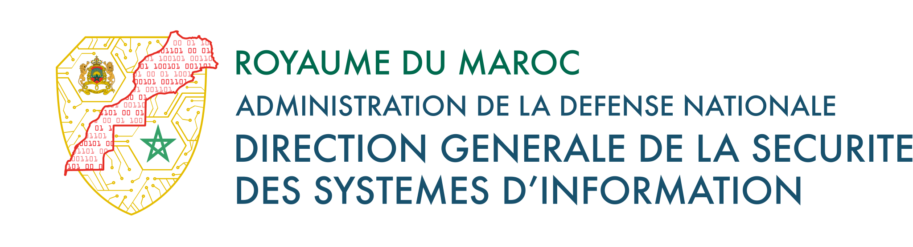
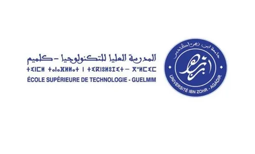

  
  

  
  

# MACC 2026 Final National CTF Morocco Writeups

This repository contains the official final-phase writeups prepared by **CYBERDUNE CLUB**, representing **ESTG, Ibn Zohr University**, for the **MACC 2026 National CTF Morocco**.

## Team Profile

- Team: `CYBERDUNE CLUB`
- Institution: `ESTG, Ibn Zohr University`
- Region: `Guelmim-Oued Noun`
- Distinction: `First-ranked team from the Guelmim-Oued Noun region`

## Competition Results

- Final ranking: `Top 8` out of `38` finalist teams
- Overall ranking: `Top 8` out of `1,156` teams in the competition

## About This Repository

This collection documents the challenge solutions developed by the team during the final phase of the competition. Each folder contains a dedicated writeup for one lab, with screenshots or supporting material when available.

## Challenge Index

| Lab | Focus | Files |
| --- | --- | --- |
| Australia | OCR-routed hidden workflow and Jinja SSTI in DocuFlow | [`australia/README.md`](australia/README.md), [`australia/australia.png`](australia/australia.png) |
| Germany | Multi-stage phishing intrusion leading to Remcos analysis | [`germany/README.md`](germany/README.md), [`germany/germany.png`](germany/germany.png), [`germany/answer.txt`](germany/answer.txt) |
| India | Redis foothold, container escape, pivot, and Linux privilege escalation | [`india/README.md`](india/README.md), [`india/india.png`](india/india.png) |
| Mexico | Nginx UI backup disclosure leading to root management access | [`mexico/README.md`](mexico/README.md) |
| Turkey | Laravel Livewire nested hydration RCE | [`turkey/README.md`](turkey/README.md), [`turkey/turkey.png`](turkey/turkey.png) |

## Purpose

The goal of this repository is to preserve a clean, professional record of the team’s technical work during the MACC 2026 final, including attack paths, exploitation logic, relevant indicators, and concise remediation guidance where appropriate.
