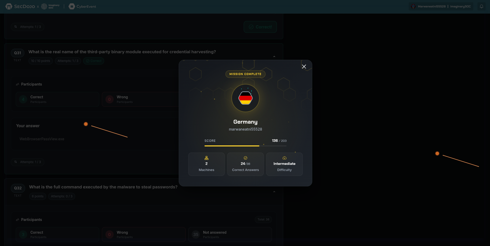

# Germany Lab Writeup

## MACC 2026 National CTF Morocco

Presented by Team CyberDune Club and EST Guelmim, Ibn Zohr University



## Executive Summary

The Germany lab focused on a multi-stage Windows malware intrusion that began with a phishing email and ended with a fully operational Remcos infection. The chain included malicious email delivery, PowerShell-based staging, reflective loading of a .NET component, registry persistence, credential harvesting, screenshot exfiltration, process injection, C2 communication, and final cleanup.

## Initial Infection

The intrusion started with a purchase-order themed phishing email:

- Subject: `[SPF KO] Order Placement PO 602350`
- Sender: `arjun@remcorp.dojo`
- Attachment: `PO No 602350.rar`
- MITRE ATT&CK: `T1566.001`

The malicious file associated with delivery had the following MD5 hash:

```text
5797120155f72b86920a708ab2ec607c
```

This stage relied on social engineering and a business-themed lure designed to pressure the victim into opening the attachment quickly.

## Stage 1: PowerShell Loader

Once executed, the infection chain reconstructed and launched a heavily obfuscated PowerShell command. That loader performed staging, network communication, decoding, and in-memory execution.

Key findings from this phase:

- WMI namespace used by the script: `winmgmts:root\cimv2`
- Second-stage URL: `http://archve.org/MSI_PRO_20281135.png`
- Second-stage MD5: `569e616d712de880288c6197c01539bd`

The recovered PowerShell was not a simple downloader. It also prepared the host environment, decoded payload material from Base64, and passed execution into a secondary .NET component.

## Stage 2: Reflective .NET Loading

The downloaded second stage unpacked and reflectively loaded a .NET assembly derived from the legitimate TaskScheduler library:

- Extracted payload MD5: `e9c3acfd36278fb891d4f44c15a68bb2`
- Associated upstream project: `https://github.com/dahall/TaskScheduler`
- Loader function invoked: `VAi`
- MITRE ATT&CK for loading method: `T1620`

This is a notable tradecraft decision. Instead of writing a normal executable and launching it directly, the actor used reflective loading to make analysis harder and reduce obvious disk artifacts during execution.

## Persistence

The malware established user-level persistence through the Windows Run registry key:

- Registry path: `HKCU\Software\Microsoft\Windows\CurrentVersion\Run`
- Value name: `displayable`
- Stored command:

```text
wscript.exe //b "C:\Users\Public\Downloads\K7vX2m9L.js"
```

This persistence method ensured the JavaScript-based stager could be relaunched automatically without requiring elevated privileges.

## Final Payload: Remcos

The infection eventually retrieved the final payload from:

```text
http://cutec.co.za/arquivo_20211526075950.txt
```

The malware stored the resulting payload at:

```text
C:\Users\Administrator\AppData\Local\Temp\D4jN6p1R.exe
```

Final payload details:

- Family: `Remcos`
- MD5: `db9adcb66be33e264f7cbaeda8d2c3f9`
- Resource location for C2 config: `RCDATA:SETTINGS`
- Encryption algorithm: `RC4`
- RC4 key: `1df356165637c3b6064086180f2d55d8`
- Signature bytes: `2404ff00`
- Delimiter sequence: `7c1e1e1f7c`
- Mutex: `Global\Rmc-ID3RBF`

These indicators confirmed that the final stage was not a generic loader but a configured Remcos implant with a stable runtime identity and recoverable encrypted configuration.

## Anti-Analysis and Injection

The loader implemented several anti-VM checks before fully activating:

- Querying BIOS and system manufacturer information
- Checking for hardware resource limitations
- Verifying specific registry keys and ACPI tables

Later in execution, the watchdog component used process injection:

- MITRE ATT&CK: `T1055.012`
- Target process: `C:\Windows\System32\fsutil.exe`

The malware then remained silent for `7` seconds before beginning command-and-control activity.

## Collection and Post-Compromise Activity

The malware supported both host reconnaissance and data theft. Observed capabilities included:

- Initial CLI command sent by the operator: `0e:netstat -ano`
- Exfiltrated screenshot path:

```text
C:\Users\Administrator\AppData\Roaming\Screenshots\time_20260326_161322.bmp
```

- Exfiltrated screenshot MD5: `9ba02a9132294d54bd7f137175c14a7b`
- Third-party credential harvesting binary: `WebBrowserPassView.exe`
- Password theft command:

```text
"C:\Users\Administrator\AppData\Local\Temp\frAQBc.exe" /stext "C:\Users\Administrator\AppData\Local\Temp\frAQBc.txt"
```

- Captured credentials: `cicamo3022@muncloud.com:p@ssw0rd9753`
- Captured keylogger string: `secdojo[SHIFT]@9628`
- External geolocation API: `http://geoplugin.net/json.gp`

This combination shows that the operator was interested in network visibility, browser-stored credentials, user input, location awareness, and graphical desktop capture.

## Operator Interaction and Cleanup

The attacker used command `0x26` to trigger:

- Windows API: `MessageBoxA`
- Raw string: `Secdojo|you have been hacked`

The final cleanup action used:

```text
wscript.exe "C:\Users\ADMINI~1\AppData\Local\Temp\8Wsa1xVPfv.vbs"
```

This indicates deliberate post-execution cleanup and self-deletion behavior, which is consistent with efforts to reduce forensic residue after the session.

## Key Indicators

- Delivery ATT&CK: `T1566.001`
- Reflective loading ATT&CK: `T1620`
- Injection ATT&CK: `T1055.012`
- Delivery hash: `5797120155f72b86920a708ab2ec607c`
- Second-stage hash: `569e616d712de880288c6197c01539bd`
- Extracted loader hash: `e9c3acfd36278fb891d4f44c15a68bb2`
- Final Remcos hash: `db9adcb66be33e264f7cbaeda8d2c3f9`
- Second-stage URL: `http://archve.org/MSI_PRO_20281135.png`
- Final payload URL: `http://cutec.co.za/arquivo_20211526075950.txt`

## Supporting Material

The exact validated lab answers are included in:

- [`answer.txt`](answer.txt)

## Conclusion

The Germany lab demonstrated a complete phishing-to-implant workflow with realistic post-compromise behavior. The attack moved from email delivery into staged PowerShell execution, reflective loading, registry persistence, Remcos deployment, process injection, credential theft, screenshot collection, operator interaction, and cleanup. As a malware-analysis lab, it was valuable because it tied together host artifacts, network indicators, ATT&CK mapping, and concrete malware configuration details into one coherent intrusion narrative.
