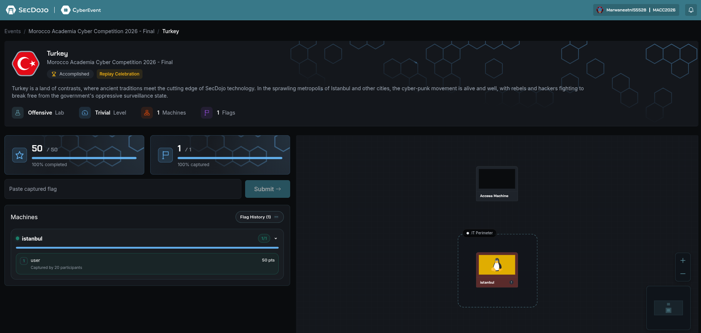

# Turkey Lab Writeup

## MACC 2026 National CTF Morocco

Presented by Team CyberDune Club and EST Guelmim, Ibn Zohr University



## Executive Summary

The Turkey lab was a web exploitation challenge against a Laravel 11 application with Livewire enabled. The key issue was not a generic Laravel debugging flaw and not the unrelated WordPress CVE initially considered. The real attack path was a Livewire remote code execution bug through nested property hydration, identified in the notes as `CVE-2025-54068` / `GHSA-29cq-5w36-x7w3`. By abusing a public `services` property in the exposed Livewire component, it was possible to execute arbitrary commands as `www-data` and read the local flag file.

## Scope

- Ops box: `13.48.84.182`
- Target host: `176.16.60.181`
- Frontend endpoint: `http://176.16.60.181:443/`
- Key update endpoint: `http://176.16.60.181:443/livewire/update`
- Objective: obtain code execution and recover `/home/local.txt`

One unusual but important detail was that port `443` served plain HTTP rather than HTTPS.

## Initial Reconnaissance

The application exposed several useful Laravel and Livewire paths:

- `/`
- `/up`
- `/livewire/update`
- `/livewire/livewire.js`
- `/_ignition/health-check`

Initial inspection of the homepage revealed key Livewire markers:

- `wire:snapshot="..."`
- `data-csrf="..."`
- `data-update-uri="/livewire/update"`

These values were enough to build a legitimate-looking Livewire update request without needing to guess framework internals from scratch.

## Vulnerability Identification

The challenge notes explicitly ruled out `CVE-2024-47337`, which applies to a WordPress plugin and was therefore a distraction on this target. The relevant weakness was a Livewire hydration issue that accepted nested synthetic tuples during state updates.

What made the target exploitable:

- Livewire component state was reachable through the public property `services`
- The application accepted crafted nested hydration tuples in update requests
- That behavior enabled a known gadget chain leading to command execution

In effect, the vulnerability allowed attacker-controlled object structures to pass through Livewire update hydration and reach dangerous Laravel gadget paths.

## Proof of Code Execution

A proof payload using the `system` function with command `id` returned:

```text
uid=33(www-data) gid=33(www-data) groups=33(www-data)
```

This confirmed remote code execution in the web server context and established that no additional privilege escalation was required to access the flag file used in the lab.

## Exploitation Workflow

The solve path used a Python script executed from the ops box:

1. Request the homepage.
2. Extract the `data-csrf` token.
3. Extract the HTML-escaped `wire:snapshot` value.
4. Construct a malicious Livewire update payload targeting `services`.
5. Inject the serialized gadget chain.
6. Submit the payload to `/livewire/update`.
7. Execute `sh -c 'cat /home/local.txt'`.

The important operational idea was to preserve the normal Livewire request structure while replacing the nested `services` update data with the gadgetized payload.

## Payload Strategy

The exploit used:

- Function: `system`
- Command: `sh -c 'cat /home/local.txt'`

The Python helper script performed two necessary runtime substitutions:

- inject the current CSRF token
- inject the current Livewire snapshot from the homepage

This made the request valid in the eyes of the application while still carrying the attacker-controlled nested structure.

Representative request target:

```text
POST /livewire/update
```

Representative header:

```text
X-Livewire: true
```

## Flag Retrieval

Once the malicious update was submitted successfully, the response contained the contents of the target file:

```text
flag_419a4665_ba76_4734_9b50_1928f955f126
```

This completed the lab directly from the RCE primitive, without needing persistence, credential theft, or lateral movement.

## Root Cause

The root issue was unsafe hydration of complex nested Livewire data into server-side objects. Combined with a reachable public component property and a usable gadget chain in the Laravel ecosystem, this resulted in direct remote code execution.

Contributing factors included:

- exposed Livewire update endpoint
- public mutable component state
- acceptance of nested synthetic tuple structures
- unsafe object hydration behavior
- availability of a working gadget chain in the application environment

## Defensive Recommendations

- Patch Livewire to a version not vulnerable to nested property hydration abuse.
- Reduce exposure of public mutable component properties where possible.
- Validate and constrain complex hydrated state structures rigorously.
- Monitor abnormal traffic to `/livewire/update`, especially large nested JSON bodies.
- Treat framework-specific state synchronization endpoints as high-risk attack surfaces during assessments.

## Conclusion

The Turkey lab was a clean example of modern framework exploitation. What looked at first like a generic Laravel target or an Ignition-style issue was actually a Livewire-specific hydration bug that enabled code execution through crafted component state updates. By extracting the page snapshot and CSRF token, building a valid malicious update request, and targeting the `services` property, it was possible to execute commands as `www-data` and recover the flag immediately.
